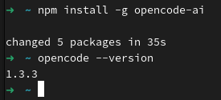
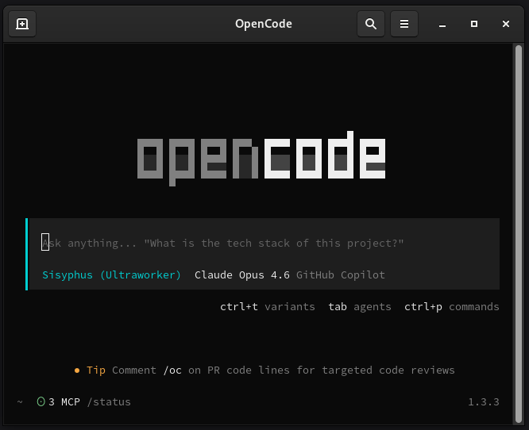
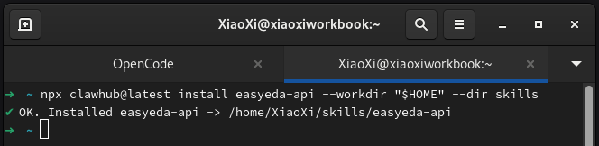
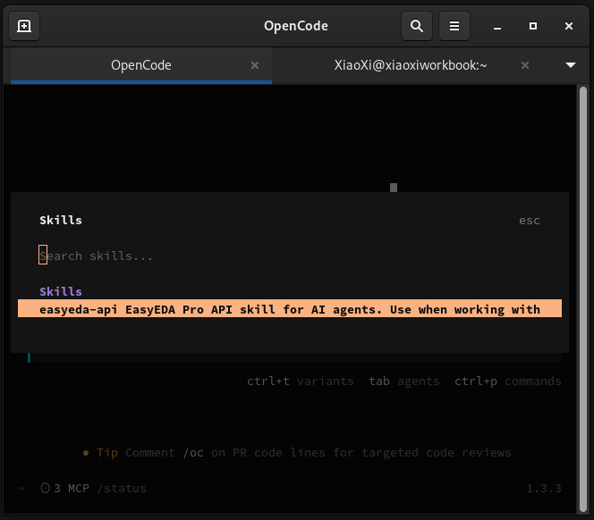
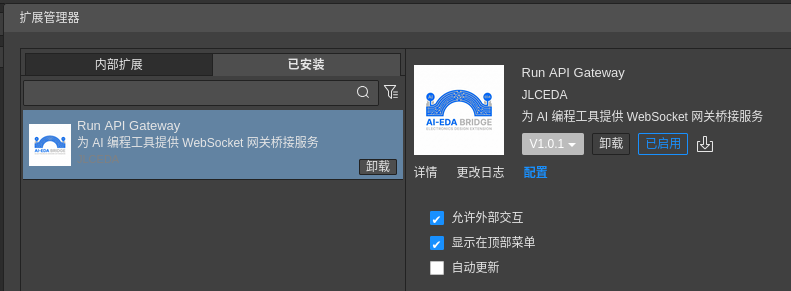
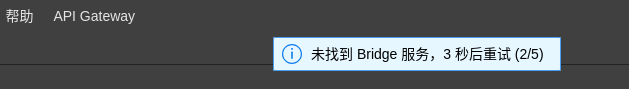
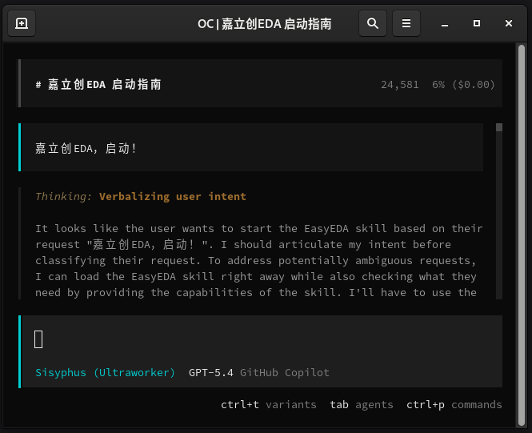
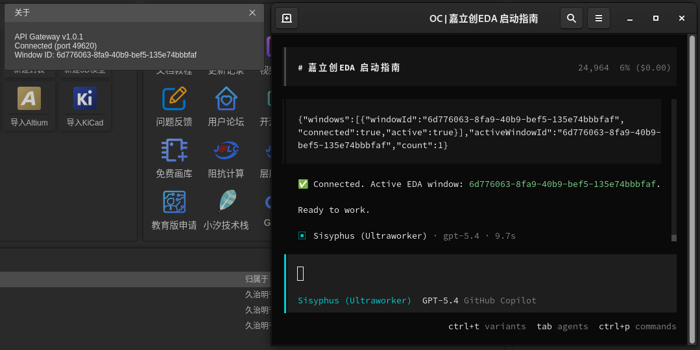

# Run API Gateway

嘉立创EDA 专业版扩展 — 为 AI 编程工具（OpenCode、QwenCode、KimiCode 等）提供 WebSocket API 网关桥接服务。

## 功能

- 🔌 **自动连接** — 启动时自动扫描端口范围 49620-49629，发现并连接 Bridge Server
- 🤝 **握手验证** — 通过 HTTP `/health` 和 WebSocket handshake 验证服务身份 (`easyeda-bridge`)
- 🔄 **自动重连** — 心跳检测 + 断线自动重新扫描端口
- 🤖 **代码执行** — 接收来自 AI 的代码请求，在 EDA 环境中执行并返回结果

## 架构

```
┌──────────────┐  HTTP/WS    ┌─────────────────┐  WebSocket   ┌──────────┐
│  AI Agent    │ ◄─────────► │  Bridge Server  │ ◄──────────► │ 本扩展    │
│ (Skill Tool) │ Port Range  │  (Node.js)      │  Port Range  │ (EasyEDA)│
└──────────────┘ 49620-49629 └─────────────────┘  49620-49629 └──────────┘
```

## 配合使用

本扩展需要配合 **easyeda-api** Skill 一起使用：

- 推荐安装命令（安装到 OpenCode 的全局 Skill 目录）：
  - Windows PowerShell：`npx clawhub@latest install easyeda-api --workdir "$HOME/.config/opencode" --dir skills`
  - Windows cmd：`npx clawhub@latest install easyeda-api --workdir "%USERPROFILE%\.config\opencode" --dir skills`
  - macOS / Linux：`npx clawhub@latest install easyeda-api --workdir "$HOME/.config/opencode" --dir skills`
- 用途：该 Skill 提供 Bridge Server、EasyEDA API 文档、调用约定，以及 AI 与 EDA 之间的完整工作流

## 专业用户快速路径

如果你已经熟悉终端、Node.js、OpenCode 和嘉立创EDA 扩展系统，可以直接走最短路径：

1. 安装 **Node.js 22 LTS** 或更高版本：<https://nodejs.org/zh-cn/download>
2. 安装 OpenCode：`npm install -g opencode-ai`
3. 把 **easyeda-api** 安装到 OpenCode 的全局 Skill 目录：
  - PowerShell：`npx clawhub@latest install easyeda-api --workdir "$HOME/.config/opencode" --dir skills`
  - cmd：`npx clawhub@latest install easyeda-api --workdir "%USERPROFILE%\.config\opencode" --dir skills`
  - macOS / Linux：`npx clawhub@latest install easyeda-api --workdir "$HOME/.config/opencode" --dir skills`
4. 启动 OpenCode：`opencode`
5. 首次使用时执行 `/connect`，可自行配置 API Key，也可直接选择 OpenCode 提供的免费模型
6. 在嘉立创EDA 专业版安装 **Run API Gateway** 扩展，并在扩展管理器中勾选 **允许外部交互** 与 **显示在顶部菜单**
7. 打开嘉立创EDA，看到顶部 **API Gateway** 菜单即可
8. 回到 OpenCode，输入：`嘉立创EDA，启动！`

如果你是首次接触这些工具，请继续阅读下面的完整新手教程。

## 从零开始使用教程

这一节按“全新电脑首次配置”的视角来写。你只要依次完成以下步骤，就可以让 OpenCode 通过本扩展调用嘉立创EDA 专业版中的 API。

### 0. 你最终会得到什么

完成本文后，你将具备以下能力：

1. 在电脑上正确安装并验证 **Node.js**
2. 安装并启动 **OpenCode**
3. 在 OpenCode 中安装 **easyeda-api** Skill
4. 在嘉立创EDA 专业版中安装并启用 **Run API Gateway** 扩展
5. 让 AI 成功连接到正在运行的 EDA 窗口
6. 让 AI 直接调用 EDA API，例如读取当前工程信息、获取当前窗口状态等

### 1. 准备环境

开始前，请先确认你已经具备以下条件：

- 本篇“从零开始使用教程”默认你使用的是 **Windows 10** 或 **Windows 11**；如果你的系统版本低于 **Windows 10**，建议先升级系统后再继续
- 如果你不确定自己的 Windows 版本，可以按键盘 **Win** 键，输入 **winver** 并回车查看系统版本
- 已熟悉嘉立创EDA 专业版的使用
- 电脑可以访问互联网，用于安装依赖与下载工具
- 你可以准备自己的 AI 模型提供商账号或 API Key；如果暂时没有，也可以先使用 OpenCode 提供的免费模型开始体验
- 建议安装 **Node.js 22 LTS** 或更高版本，这样对 OpenCode 和相关工具兼容性更稳妥
- 本教程中的大部分高级功能效果都依赖模型能力；如果你要测试更复杂的理解、规划、代码生成和 API 调用链路，建议优先选择总体测评参数较好的大模型

### 2. 安装 Node.js

**OpenCode** 和 Skill 安装命令都依赖 Node.js，因此这是第一步。

> TIP
>
> Windows 用户如果不知道怎么打开终端，可以按键盘 **Win** 键，输入 **PowerShell**，然后点击打开 **Windows PowerShell** 或 **PowerShell**。通常它打开后默认就在你的用户目录下，这正适合后续直接执行本文中的命令。

#### 2.1 下载并安装

推荐前往 Node.js 官网安装 **22 LTS** 或更高版本：<https://nodejs.org/zh-cn/download>

> TIP
>
> 如果你已经熟悉包管理器，也可以使用系统包管理器安装；但对于大多数首次使用者，直接使用官网安装包最省心。

#### 2.2 验证安装是否成功

安装完成后，打开终端执行：

```bash
node -v
npm -v
```

如果终端能输出版本号，例如 `v22.x.x` 或 `24.x.x`，说明 Node.js 已安装成功。


#### 2.3 常见问题

- 如果提示 `command not found`，通常是安装后没有重新打开终端
- 如果你安装了多个 Node 版本，请确保当前终端使用的是较新的版本
- Windows 用户建议重新打开终端或重启系统后再验证

### 3. 安装 OpenCode

推荐使用 **npm** 方式安装，在终端执行：

```bash
npm install -g opencode-ai
```

安装完成后，执行以下命令验证：

```bash
opencode --version
```

只要能正确输出版本号，就说明 OpenCode 已安装完成。



> TIP
>
> 如果你使用的是 macOS / Linux，也可以使用官方安装脚本：
>
> ```bash
> curl -fsSL https://opencode.ai/install | bash
> ```

### 4. 首次启动 OpenCode 并连接模型

对于新手，推荐直接在“用户目录”里打开终端并运行 **OpenCode**，不要一开始就纠结“工作目录”是什么。

- Windows 用户：打开 **PowerShell** 后，默认通常已经位于你的用户目录
- macOS / Linux 用户：打开终端后，也通常会默认位于你的用户目录

也就是说，绝大多数情况下，你打开终端后直接继续执行下面命令即可：

```bash
opencode
```



首次使用时，建议完成以下初始化操作：

1. 如果你拥有模型提供商的订阅，就在 OpenCode 界面中执行 `/connect`，否则直接跳到第 5 步
2. 选择你要使用的模型提供商
  
3. 你可以按提示登录或填写自己的 API Key
4. 看到连接成功提示后，返回主界面
5. 在 OpenCode 界面中执行 `/models` 切换模型（可以选择免费或你前面连接的模型提供商的付费模型）
  

如果这一步没有完成，后续即使 Skill 和扩展都安装好了，OpenCode 也无法真正帮你调用 EDA。

> TIP
>
> 使用免费模型可以先完成基础体验，但本教程中很多能力，尤其是复杂指令理解、多步骤规划、长链路调用和结果整理，都会明显受到模型能力影响。若你要更稳定地测试完整流程，建议优先选择总体测评参数较好的大模型。

### 5. 安装 EasyEDA API Skill

本扩展本身只负责“让 EDA 接入桥接网络”，真正负责启动 Bridge Server、提供 API 文档、指导 AI 进行调用的是 **easyeda-api** Skill。

为了让它对所有项目都可用，推荐把 Skill 安装到 OpenCode 实际会扫描的全局 Skill 目录中。

OpenCode 常见的全局 Skill 扫描路径包括：

- `~/.agents/skills/`
- `~/.config/opencode/skills/`

其中更推荐使用 `~/.config/opencode/skills/` 作为安装目标。

#### 5.1 从 ClawHub 单行命令安装

对于大多数用户，直接打开终端后按你的系统与终端类型执行对应命令即可：

如果你是跟着本文从零开始操作的 **Windows** 用户，并且前面打开的是 **PowerShell**，那么请直接执行下面 **Windows PowerShell** 这一条，不需要执行 **Windows cmd** 那一条。

**Windows PowerShell**

```powershell
npx clawhub@latest install easyeda-api --workdir "$HOME/.config/opencode" --dir skills
```

**Windows cmd**

```bat
npx clawhub@latest install easyeda-api --workdir "%USERPROFILE%\.config\opencode" --dir skills
```

**macOS / Linux**

```bash
npx clawhub@latest install easyeda-api --workdir "$HOME/.config/opencode" --dir skills
```

这条命令的含义是：

- `--workdir ...`：把安装位置固定到 OpenCode 的全局配置目录
- `--dir skills`：把 Skill 放到 OpenCode 会自动扫描的 `skills/` 文件夹里

执行完成后，目标目录通常会变成：

- Windows PowerShell：`$HOME/.config/opencode/skills/easyeda-api`
- Windows cmd：`%USERPROFILE%\.config\opencode\skills\easyeda-api`
- macOS / Linux：`~/.config/opencode/skills/easyeda-api`



#### 5.2 如果命令安装失败，如何手动下载并安装 Skill

如果你遇到网络限制、`npx` 不可用、`clawhub` 无法正常执行，或者就是想手动安装，也可以直接下载压缩包并放到本地 Skill 目录中。

手动下载地址：

- <https://image.lceda.cn/files/easyeda-api.zip>

手动安装步骤如下：

1. 下载上面的 `easyeda-api.zip`
2. 在 OpenCode 的全局 Skill 目录下找到或新建 `skills` 文件夹
3. 在 `skills` 文件夹里新建一个 `easyeda-api` 文件夹
4. 将 `easyeda-api.zip` 解压到这个 `easyeda-api` 文件夹中
5. 解压完成后，确认目录结构正确

推荐的目标路径示例：

- Windows：`%USERPROFILE%\.config\opencode\skills\easyeda-api`
- macOS / Linux：`~/.config/opencode/skills/easyeda-api`

解压完成后，`easyeda-api` 文件夹下应该能直接看到这些内容：

- `SKILL.md`
- `package.json`
- `guide/`
- `references/`
- `user-guide/`

请特别注意：不要解压成多套嵌套目录。

- 正确示例：`~/.config/opencode/skills/easyeda-api/SKILL.md`
- 错误示例：`~/.config/opencode/skills/easyeda-api/easyeda-api/SKILL.md`

#### 5.3 安装完成之后

安装完成后，建议重新启动一次 OpenCode，或让 OpenCode 重新读取当前环境。

如果你之后是在某个具体项目目录（比如 pro-api-sdk 目录）里使用 OpenCode，也仍然可以在项目中执行：

```text
/init
```

这样 OpenCode 会初始化项目上下文，更容易正确理解你的代码仓库；但这一步不是连接 EDA 的前置条件。

使用 `/skills` 确认 Skill 已正确安装：



### 6. 在嘉立创EDA 专业版中安装本扩展

接下来需要在 EDA 这一侧安装 **Run API Gateway** 扩展。

扩展地址：

- https://ext.lceda.cn/item/oshwhub/run-api-gateway

安装完成后，请先进入嘉立创EDA 的扩展管理器，找到 **Run API Gateway** 扩展，并确认勾选以下选项：

- **允许外部交互**
- **显示在顶部菜单**



勾选完成后，确认顶部菜单或相关位置已经出现 **API Gateway** 菜单。

如果你能看到以下菜单项，说明扩展已经成功加载：

- **重新连接**
- **停止连接**
- **切换自动连接状态**
- **关于...**

### 7. 打开 EDA 并等待扩展连接

只要嘉立创EDA 专业版已经启动，并且扩展已经正确加载，就可以开始建立连接。

本扩展在加载后会自动扫描端口范围 `49620-49629`，寻找由 Skill 启动的 Bridge Server。只要 Bridge Server 已被拉起，扩展就会尝试自动连接。

此时你不需要手工填写 IP 或端口，默认工作流已经把这些流程自动化了。

> TIP
>
> 如果你之前已经打开 EDA，但没有看到连接行为，或者连接已经重试 5 次后失败，可以手动点击：
>
> - **API Gateway** → **重新连接**



### 8. 在 OpenCode 中发出启动指令

现在回到 OpenCode，直接输入下面的指令：

```text
嘉立创EDA，启动！
```

或者写得更明确一点：

```text
请使用 easyeda-api Skill 连接我当前打开的嘉立创EDA 专业版窗口，并检查连接状态。
```

此时 OpenCode 会：

1. 读取 **easyeda-api** Skill 的工作流说明
2. 启动或检查 Bridge Server
3. 通过 `/health` 检查服务状态
4. 与 EDA 侧的 **Run API Gateway** 扩展完成握手
5. 在连接成功后，准备执行后续 API 调用

如果一切正常，你会看到类似以下结果：

- Bridge Server 已启动
- 已找到 EDA 客户端
- Bridge 已连接
- 可以开始执行 API 调用
- Connected
- Ready to work





### 9. 验证是否真的已经可以调用 EDA

连接成功后，不要马上做复杂操作，建议先执行一个最简单的验证命令。

你可以在 OpenCode 中输入类似下面的提示：

```text
请先检查当前嘉立创EDA 窗口是否已经连接成功，并返回当前窗口状态、当前编辑器类型，以及当前是否存在已打开的工程。
```

或者：

```text
请做一次只读验证：如果当前没有打开工程，也请告诉我当前 EDA 环境是否已经可以正常接收 API 调用。
```

如果调用成功，OpenCode 会返回来自 EDA 的真实执行结果，而不是只给你一段理论说明。

这说明以下链路已经全部打通：

**OpenCode** → **easyeda-api Skill** → **Bridge Server** → **Run API Gateway** → **嘉立创EDA 专业版**

### 10. 一个最推荐的新手完整操作顺序

如果你想严格照着做，可以直接按下面顺序执行：

如果你是跟着本文从零开始操作的 **Windows** 用户，请优先使用下面标注为 **Windows PowerShell** 的那条命令；只有当你明确自己使用的是 **cmd** 时，才执行 **Windows cmd** 那条。

```bash
# 1) 安装并验证 Node.js
node -v
npm -v

# 2) 安装 OpenCode
npm install -g opencode-ai
opencode --version

# 3) 安装 easyeda-api Skill 到 OpenCode 的全局 Skill 目录
# Windows PowerShell
npx clawhub@latest install easyeda-api --workdir "$HOME/.config/opencode" --dir skills

# Windows cmd
npx clawhub@latest install easyeda-api --workdir "%USERPROFILE%\.config\opencode" --dir skills

# macOS / Linux
npx clawhub@latest install easyeda-api --workdir "$HOME/.config/opencode" --dir skills

# 4) 启动 OpenCode
opencode
```

进入 OpenCode 后，再依次完成以下动作：

1. 执行 `/connect`，配置模型提供商，或直接选择免费模型
2. 如有需要执行 `/init`
3. 打开嘉立创EDA 专业版并确保已安装 **Run API Gateway**
4. 在扩展管理器中确认已勾选 **允许外部交互** 与 **显示在顶部菜单**
5. 在 OpenCode 中输入：`嘉立创EDA，启动！`
6. 连接成功后，让 AI 执行一个简单只读 API 查询进行验证

### 11. 连接失败时怎么排查

如果你已经按步骤操作，但还是不能连接，建议按以下顺序排查：

#### 11.1 检查 OpenCode 是否可用

```bash
opencode --version
```

如果这一步失败，先回到第 3 步重新安装 OpenCode。

#### 11.2 检查 Skill 是否已经安装

先回到 OpenCode，输入：

```text
/skills
```

查看当前技能列表里是否已经出现 **easyeda-api**。

- 如果已经看到 **easyeda-api**，说明 Skill 已经安装成功
- 如果没有看到，可以再次执行下面对应你终端类型的安装命令进行尝试：

如果你是跟着本文从零开始操作的 **Windows** 用户，并且一直使用的是 **PowerShell**，那么这里优先执行下面标注为 **Windows PowerShell** 的那条命令即可。

```powershell
# Windows PowerShell
npx clawhub@latest install easyeda-api --workdir "$HOME/.config/opencode" --dir skills

# Windows cmd
npx clawhub@latest install easyeda-api --workdir "%USERPROFILE%\.config\opencode" --dir skills

# macOS / Linux
npx clawhub@latest install easyeda-api --workdir "$HOME/.config/opencode" --dir skills
```

如果命令安装仍然失败，可以回到前面的 [5.2 如果命令安装失败，如何手动下载并安装 Skill](README.md#52-如果命令安装失败如何手动下载并安装-skill) 按步骤手动安装。

如果安装过程中报错，通常是 Node.js、网络、或 npm 权限问题。

#### 11.3 检查 EDA 扩展是否真的已加载

确认嘉立创EDA 中是否能看到 **API Gateway** 菜单，并确认扩展管理器中已经勾选 **允许外部交互** 与 **显示在顶部菜单**。如果菜单都没有出现，就说明扩展还没有真正运行。

#### 11.4 检查 EDA 是否已经启动

本扩展不要求你先打开工程。只要嘉立创EDA 已经启动，并且扩展已经加载，就可以连接。

#### 11.5 手动触发重连

在 EDA 顶部菜单中点击：

- **API Gateway** → **重新连接**

然后再回到 OpenCode 重试一次：

```text
请重新连接嘉立创EDA，并检查当前桥接状态。
```

#### 11.6 完全重启流程

如果仍然不行，最有效的方式通常是按下面顺序全部重启：

1. 关闭 OpenCode
2. 关闭嘉立创EDA 专业版
3. 重新打开嘉立创EDA，并确认扩展已加载
4. 回到用户目录或你平时使用的目录，再次启动 `opencode`
5. 再次执行连接指令

### 12. 适合直接复制给 OpenCode 的示例提示词

以下提示词适合刚完成安装后的首次验证：

```text
请使用 easyeda-api Skill 连接当前打开的嘉立创EDA 专业版窗口，并告诉我是否连接成功。
```

```text
如果已经连接成功，请返回当前 EDA 窗口状态、当前编辑器类型，以及当前是否已经打开工程。
```

```text
请先不要修改工程，只做只读检查，确认我当前的 EDA 环境是否可正常调用 API。
```

```text
请列出你当前能够调用的嘉立创EDA 相关能力，并告诉我下一步可以做什么。
```

### 13. 这套方案里每个组件分别做什么

为了避免你混淆，这里再次说明各组件职责：

- **Node.js**：提供运行时环境，让 OpenCode 与相关命令可以运行
- **OpenCode**：你与 AI 交互的入口
- **easyeda-api** Skill：告诉 AI 应该如何连接与调用 EDA，并负责 Bridge Server 工作流
- **Run API Gateway** 扩展：运行在嘉立创EDA 内部，负责接收桥接请求并执行代码
- **嘉立创EDA 专业版**：真正被操作的目标程序

理解这几点后，排查问题会非常快：

- OpenCode 没装好 → AI 根本启动不了
- Skill 没装好 → AI 不知道怎么连接 EDA
- 扩展没装好 → EDA 侧无法接收请求
- EDA 没打开 → 即使桥接起来，也没有可操作窗口

### 14. 补充说明：开发者本地调试模式

如果你不是普通用户，而是在本地调试 `easyeda-api-skill` 仓库，也可以手动启动 Bridge Server：

```bash
cd /path/to/easyeda-api-skill
npm install
npm run server
```

服务器会自动在 `49620-49629` 之间寻找可用端口。此时再打开嘉立创EDA，并确保本扩展已经加载，就可以进入本地联调模式。

不过对于大多数用户，推荐优先使用上面的标准流程，也就是直接通过 OpenCode + **easyeda-api** Skill 完成自动连接。

## 菜单操作

| 菜单项 | 说明 |
|--------|------|
| **Reconnect** | 手动重新扫描端口并连接 Bridge Server |
| **Stop Connection** | 断开当前连接 |
| **Toggle Auto-Connect Status** | 切换自动连接状态 |
| **About...** | 显示版本和连接状态 |

## 开发

```bash
# 安装依赖
npm install

# 编译扩展包
npm run build
```

编译后在 `./build/dist/` 下生成 `.eext` 扩展包文件，可在嘉立创EDA专业版中安装。

## 开源许可

本扩展使用 [Apache License 2.0](https://choosealicense.com/licenses/apache-2.0/) 开源许可协议。
